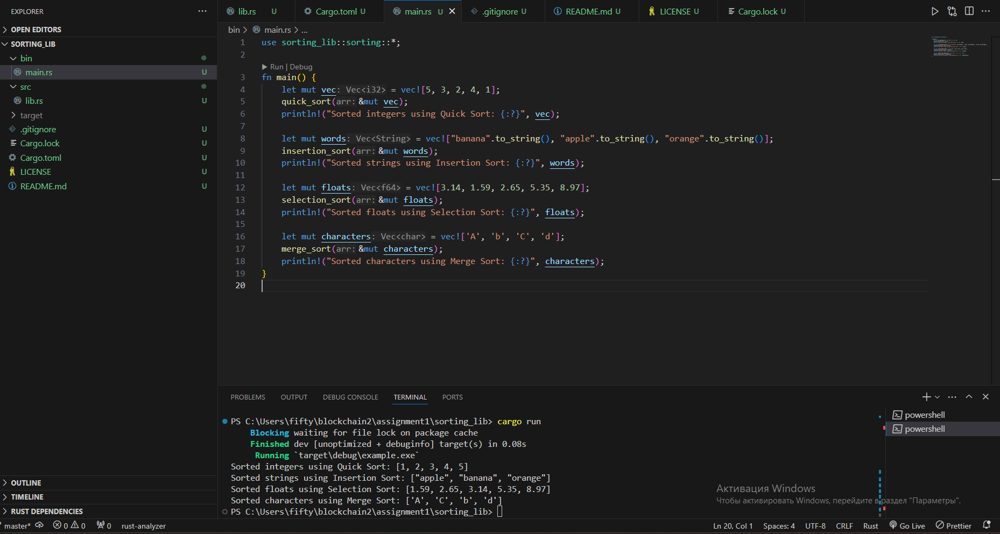

# Sorting Library by Blisstod

This library, written in Rust, provides a variety of sorting algorithms capable of sorting arrays of any type that implements the `PartialOrd` and `Clone` traits. This includes common types like integers, floating points, strings, and custom structs or enums, provided they meet the trait requirements.

## Included Sorting Algorithms

The library includes the following sorting algorithms with additional resources to learn more:

- **Quick Sort**: A divide and conquer algorithm with average-case time complexity of O(n log n). It is efficient for large datasets. [Learn more about Quick Sort](https://www.geeksforgeeks.org/quick-sort/).
- **Insertion Sort**: Best suited for small or nearly sorted datasets, with a time complexity of O(n^2) in the worst case. [Learn more about Insertion Sort](https://www.geeksforgeeks.org/insertion-sort/).
- **Selection Sort**: A simple sort that is less efficient for large datasets, with a time complexity of O(n^2). [Learn more about Selection Sort](https://www.geeksforgeeks.org/selection-sort/).
- **Merge Sort**: A highly efficient and stable sort with a time complexity of O(n log n), recommended for larger datasets. [Learn more about Merge Sort](https://www.geeksforgeeks.org/merge-sort/).

## Usage

1. **Dependencies**: To integrate this sorting library into your Rust project, add it to your `Cargo.toml` dependencies:

```toml
[dependencies]
sorting_lib = { path = "path_to_sorting_lib" }
sorting_lib = "0.1.0"
//other dependencies
```

Replace <path_to_sorting_lib> with the actual path to where this library is stored on your local machine.

2. **Image Example**:


3. **Examples**: It's important to either have a separate `examples/` directory with standalone example files that users can run, or the examples should be included as part of the documentation or tests. If you've placed examples within the `bin/main.rs`, indicate how to run the `example` binary:

```rust
use sorting_lib::sorting::*;

fn main() {
    let mut characters = vec!['A', 'b', 'C', 'd'];
    merge_sort(&mut characters);
    println!("Sorted characters using Merge Sort: {:?}", characters);
}
```

```rust
use sorting_lib::sorting::*;

fn main() {
    let mut vec = vec![5, 3, 2, 4, 1];
    quick_sort(&mut vec);
    println!("Sorted integers using Quick Sort: {:?}", vec);
}
```


```rust
use sorting_lib::sorting::*;

fn main() {
    let mut words = vec!["banana".to_string(), "apple".to_string(), "orange".to_string()];
    insertion_sort(&mut words);
    println!("Sorted strings using Insertion Sort: {:?}", words);
}
```


```rust
use sorting_lib::sorting::*;

fn main() {
    let mut floats = vec![3.14, 1.59, 2.65, 5.35, 8.97];
    selection_sort(&mut floats);
    println!("Sorted floats using Selection Sort: {:?}", floats);
}
```
Please refer to the examples/ directory for more detailed examples on how to use the library.

## Running the Examples

To run any of the included examples, use the following command, replacing example_name with the actual name of the example:

```bash
cargo run --example example_name
```

To run the included example, use the following command:

```bash
cargo run --bin example
```
